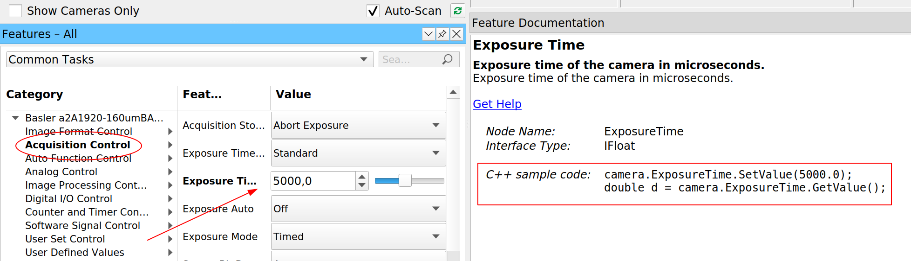
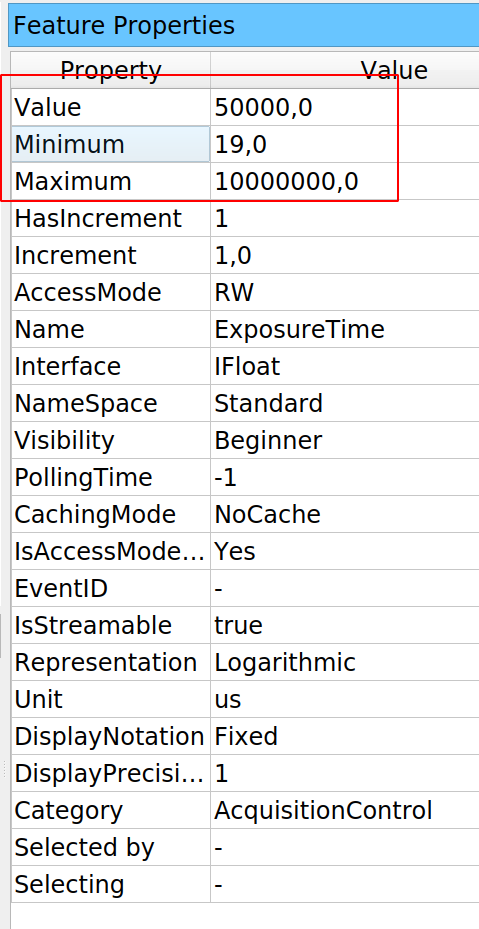
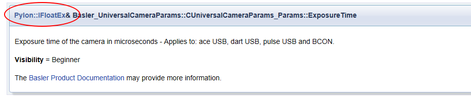

# Acquiring images from Basler Cameras
Basler offers a wide range of cameras that can be used for microscopy, computer vision, or even as security cameras. One of the cameras' advantages is that they come with a software development kit that makes them easy to integrate into our projects. Basler puts continuous effort into maintaining PyPylon, the Python bindings for their drivers. This tutorial will focus on learning how to get started with the cameras and how to leverage the existing Pylon Viewer to speed up our development. 


## Installing
To work with Basler cameras using Python, we must install the PyPylon package, which is the Python wrapper for the Pylon SDK. Basler's team improved the installation scripts of the package in the last few months, and it is now possible to install like any other package:

```bash
pip install pypylon
```

Older releases of the code required to install other dependencies first and then getting a release of pypylon from the [Github repository](https://github.com/Basler/pypylon/releases). This is still possible if we need to work with specific versions, for example, when maintaining legacy code. 

Although only PyPylon is required to work with the cameras, we will also use the [Pylon software suite](https://www.baslerweb.com/en/sales-support/downloads/software-downloads/#type=pylonsoftware;language=all;version=all), which includes Pylon Viewer, a program to quickly acquire images from the cameras. On the download page, be sure to select the package for your operating system and architecture. 

Pylon Viewer allows us to test the camera, acquire images, and configure it. Trying whether we can acquire images is important to rule out other problems. For example, on Linux systems accessing USB ports may require additional permissions. Pylon Viewer is also a great starting point for finding out the names of the functions and parameters we may need to change in our programs. 

### Problems with PyPylon installation
!!!note 
    PyPylon is evolving quickly, and some of the issues I highlight here may disappear on later releases. In any case, I have decided to keep them since they may provide valuable insight to some programmers.  

I have found that sometimes there is a mismatch between the latest Pylon version and the released PyPylon wheel available to download. Even if this does not raise problems during installation, we may face an error like the following when running the examples of this tutorial:

```bash
ImportError: cannot import name '_pylon' 
```

The best solution is to [download the PyPylon code](https://github.com/basler/pypylon), and install it locally by running:

```bash
$ python setup.py install
```

Depending on your operating system, there may be another error associated with it. In Linux, Pylon is expected in the folder ``/opt/pylon5``, but newer versions of Pylon are installed on ``/opt/pylon``. The simplest solution is to create a system variable to point the installer to the right folder:

```bash
$ export PYLON_ROOT=/opt/pylon
$ python setup.py install
```

## Getting Started
When getting started, we must make sure to identify the camera we want to work with. This is not only useful for practical matters, but it is also the first step to start understanding the patterns that drivers impose. We can run the following code:

```python
from pypylon import pylon


tl_factory = pylon.TlFactory.GetInstance()
devices = tl_factory.EnumerateDevices()
for device in devices:
    print(device.GetFriendlyName())
```

It generates a list of the cameras connected to our computer, like what we see with the PylonViewer program. The output will depend on what camera is connected to the computer, but it will look like the following:

```bash
Basler a2A1920-160umBAS (40063823)
```

Let's start by understanding the code that generated the output. It begins by creating a *transport layer* instance and enumerating the devices to which it has access. According to the manual, the transport layer is an abstraction of the physical connection between the camera and the computer (i.e., USB, Camera Link, etc.). Its primary purpose is to find and manage the life cycle of the cameras. The method ``EnumerateDevices`` returns a tuple containing information of each connected camera. 

Bear in mind that PyPylon is built using Swig, a library that automatically wraps C code into Python. If we printed ``device`` instead of its friendly name, we would get an output like this:

```python
"<pypylon.pylon.DeviceInfo; proxy of <Swig Object of type 'Pylon::CDeviceInfo *' at 0x7fb7c3cd53f0> >"
```

Which is not particularly useful. Each object returned by the enumeration of the transport layer allows for the unique identification of the camera. This means that the information contained within it is all we need to start communicating with a camera. Other methods that may be useful to identify a camera are: ``GetFullName()`` which returns a unique code like ``2676:ba05:3:2:10``, or ``GetSerialNumber()`` which returns a number like ``40063823``. 

In many cases, we have only one camera, and the rest of the article will proceed on that assumption. If it is not the case, we can address the camera we want by using its unique properties. 

## Acquiring an Image
If we are working with a camera, the first thing we may want to do is to acquire an image. We can create an ``InstantCamera`` object by running the following:

```python
tl_factory = pylon.TlFactory.GetInstance()
camera = pylon.InstantCamera()
camera.Attach(tl_factory.CreateFirstDevice())
```

Which consists of two steps. After getting the instance of the transport layer, we create an ``InstantCamera`` object. Basler provides these objects as a way of simplifying our work with their cameras, including handling the device life cycle, making event callbacks, and physical device removal. Suppose we are developing a highly specialized application. In that case, we may want to dive into Pylon's *Device objects*, which are beyond this article's scope. 

Once the ``InstantCamera`` is instantiated, we proceed to attach the first available camera to it. Note that the code above is transparent to the underlying data transport layer. We can use USB or GigE cameras with the same pattern. It is also important to point out that the transport layer is responsible for creating the actual device while ``camera`` is a convenient interface. The connection between the wrapper object ``InstantCamera`` and the actual device happens when we ``Attach`` it. 

To acquire an image, we must follow few steps that are self-explanatory:

```python
camera.Open()
camera.StartGrabbing(1)
grab = camera.RetrieveResult(2000, pylon.TimeoutHandling_Return)
if grab.GrabSucceeded():
    img = grab.GetArray()
    print(f'Size of image: {img.shape}')
camera.Close()
```

We start by opening the camera. At this stage, we establish the communication with the device, and Pylon takes care of applying some basic configuration. When we ``StartGrabbing`` with a single integer argument, we tell Pylon the number of frames we want to acquire. When the camera reaches that number of frames, it will stop acquiring new ones. This method is one of the convenience methods provided by the ``InstantCamera`` objects. 

In the code above, we grab only one frame. We retrieve the result using a timeout of 2000 milliseconds. We specify that if 2 seconds pass and there is no result, it would simply return. Another option would have been using ``TimeoutHandling_ThrowException``. 

We check that the grab actually worked by using the ``GrabSucceeded`` method. Then we get the actual data using the ``GetArray`` method. The resulting ``img`` is a numpy array. We print the shape of the image and close the camera. This is a minimal example to get started, but nothing limits us to show the image, save it, etc. In any case, the most essential step is to get data from the camera. 

## Changing Parameters
Once we can read from a device, the second most important step is to change the acquisition parameters. In the case of a camera, the exposure time is probably, one of the most important ones. The ``InstantCamera`` interface allows us to change it with the following syntax:

```python
camera.ExposureTime.SetValue(50000)
```

The syntax is pretty clear. If we want to change ``ExposureTime``, we can use a method called ``SetValue`` and provide the value in microseconds (see below for more discussion on units). If we check the Pylon manual, this is the pattern we will find for the camera's parameters. However, since we are using **PyPylon**, we can also make use of an alternative syntax:

```python
camera.ExposureTime = 50000
```

Both examples generate the same effect and show the difference between [functional or imperative programming](https://www.aquiles.me/functional_or_imperative_programming/). I, personally, believe the first one is clearer since it will always raise an error if, for example, we use ``Exposure`` instead of ``ExposureTime``.

### Getting node information
One of the reasons for favoring the imperative setting of the exposure time (i.e., using ``SetValue``) is that ``ExposureTime`` is more complex than a simple number attribute of the camera. When setting values to a device, one common concern is knowing the limits and the units of each parameter. Pylon, in that regard, is very transparent and consistent. 

```python
camera.Open()
print(camera.ExposureTime.GetUnit())
print(camera.ExposureTime.GetValue())
print(camera.ExposureTime.GetMin())
print(camera.ExposureTime.GetMax())
print(camera.ExposureTime.Unit)
print(camera.ExposureTime.Value)
print(camera.ExposureTime.Min)
print(camera.ExposureTime.Max)
camera.Close()
```

It is possible to get the units of the ``ExposureTime``and the current value, the minimum, and the maximum. The code above shows the two ways of getting the information, using ``GetUnit`` or attributes like ``Unit``. Again, this is a matter of personal preference and consistency through more extensive projects. 

## PylonViewer as the documentation entry point
The examples above are a great starting point, but the main problem is that they are limited. As soon as we want to do something slightly more complex, we will need to use a different approach. For example, we know the minimum and maximum value of the exposure time, but how do we know the minimum difference between possible values? Fortunately, Basler bundles the PylonViewer with their software package. Let's see what information it provides when we select the exposure time:



For every parameter that we can change in the camera, PylonViewer tells us what method should be used to change and retrieve the value. But this is not the only information that it provides. If we open the Feature Properties panel (must be selected under the Window menu), we can also see a table with more information for that specific property:



The PylonViewer does not allow us to see how to retrieve that information. Still, if it is on the table, it means it can be programmatically accessed. The PylonViewer gives us access to the Programmer's Guide if we click on the *Help menu*. Normally, the C++ guide is the easiest to translate into Python code. If we search for ``ExposureTime`` we will get several matches, but any ``Member List`` would be a good starting point. The information on ``ExposureTime`` may be a bit vague:



But it provides a significant hint (highlighted in red above). The Exposure time is not an ordinary number, but a ``Pylon::IFloatEx``. Without entering too much into details, if we click on it, we get the information we were looking for:

 

Every parameter that belongs to this class will have plenty of available information. The exposure time is only one of them. For basic applications, it may be slightly far-fetched. Still, it is important to learn how to navigate the documentation to get the relevant information and translate it to Python. 

## Acquiring in free-run mode
With cameras, often we want to acquire images continuously, not just one frame. Free-run means that the camera will acquire frames one after the other until we tell it to stop. With ``InstantCamera``, this can be achieved by using the method ``StartGrabbing`` without specifying a maximum number of frames:

```python
camera.Open()
camera.StartGrabbing(pylon.GrabStrategy_OneByOne)
i = 0
print('Starting to acquire')
t0 = time.time()
while camera.IsGrabbing():
    grab = camera.RetrieveResult(100, pylon.TimeoutHandling_ThrowException)
    if grab.GrabSucceeded():
        i += 1
    if i == 100:
        break

print(f'Acquired {i} frames in {time.time()-t0:.0f} seconds')
camera.Close()
```

In this example, ``StartGrabbing`` receives a strategy of ``OneByOne``, which is equivalent to first-in, first-out. Frames are acquired in order and retrieved in order. We use the method ``IsGrabbing`` to check that the camera is actually acquiring data. Note that we are using only 100 milliseconds of timeout when retrieving the result. If the exposure time is longer than that, Pylon will raise an error. We can check it by combining this example with the previous one. 

If grabbing data was successful, we increase a counter. We stop the loop if we reach 100 frames, but any other approach to stop the program at a given point is valid. It is important to note that we stop the loop, but not the grabbing itself. The grabbing stops when the camera is closed, courtesy of the ``InstantCamera`` object. We can also use ``StopGrabbing`` to stop the camera acquisition:

```python
camera.Open()
camera.StartGrabbing(pylon.GrabStrategy_OneByOne)
i = 0
print('Starting to acquire')
t0 = time.time()
while camera.IsGrabbing():
    grab = camera.RetrieveResult(100, pylon.TimeoutHandling_ThrowException)
    if grab.GrabSucceeded():
        i += 1
    if i == 100:
        camera.StopGrabbing()
        break

print(f'Acquired {i} frames in {time.time()-t0:.0f} seconds')
camera.Close()
```

## Timeout when retrieving the result
In the examples we've seen so far, we have set everything to avoid problems. However, we are one step away from getting into trouble. We are using an exposure time of 50ms and a timeout of 100ms when retrieving the result. It is worth exploring what would happen if the timeout is shorter than the exposure time. 

```python
camera.Open()
camera.ExposureTime = 105000  # in us
camera.StartGrabbing(pylon.GrabStrategy_OneByOne)
grab = camera.RetrieveResult(100, pylon.TimeoutHandling_ThrowException)
if grab.GrabSucceeded():
    print('Grab succeded')

camera.Close()
```

If we run the code above, we see that many times it runs fine. Note that the difference between exposure time and timeout is only 5ms. If there's a slight delay between starting and retrieving results, it is enough to pass through. If we try to acquire a couple of frames in a row, we'll see the problem:

```python
camera.Open()
camera.ExposureTime = 105000
camera.StartGrabbing(pylon.GrabStrategy_OneByOne)
for i in range(10):
    grab = camera.RetrieveResult(100, pylon.TimeoutHandling_ThrowException)
    if grab.GrabSucceeded():
        print('Grab succeded')

camera.Close()
```

The code above will generate an output like this:

```bash
Traceback (most recent call last):
  File "ac.py", line 17, in <module>
    grab = camera.RetrieveResult(100, pylon.TimeoutHandling_ThrowException)
  File "C:\Users\aquic\.conda\envs\disper\lib\site-packages\pypylon\pylon.py", line 3458, in RetrieveResult
    return _pylon.InstantCamera_RetrieveResult(self, *args)
_genicam.TimeoutException: Grab timed out. : TimeoutException thrown (file 'instantcameraimpl.h', line 1064)
```

This is expected since we are using the option ``pylon.TimeoutHandling_ThrowException``. We can also try to use the other option, ``TimeoutHandling_Return``, in which case we would get this output:

```python
Traceback (most recent call last):
  File "ac.py", line 18, in <module>
    if grab.GrabSucceeded():
  File "C:\Users\aquic\.conda\envs\disper\lib\site-packages\pypylon\pylon.py", line 2229, in GrabSucceeded
    return _pylon.GrabResult_GrabSucceeded(self)
_genicam.RuntimeException: No grab result data is referenced. Cannot access NULL pointer. : RuntimeException thrown (file 'grabresultptr.cpp', line 84)
```

Both snippets result in exceptions, but they have a very different origin. On the first one, it is the ``RetrieveResult`` method that raises the exception, while in the second is the ``GrabSucceeded``. For the first pattern, we can use a ``try... except`` block to catch the exception. For the second example, note that the error message states ``Cannot access NULL pointer``. This means that grab is actually NULL. We can therefore use another approach to deal with it:

```python
if grab and grab.GrabSucceeded():
    print('Grab succeded')
```

It must be clear that ``if grab`` is ``True`` only when the RetrieveResult didn't timeout. On the other hand, Python tests if-statements sequentially. It will first check ``if grab`` and *only* if it passes, it checks for ``GrabSucceeded()``. In this way, we can quickly prevent the error without try-excepts. 

## Using callbacks
Python programmers often do not use callbacks, but they can be a useful pattern and worth discussing them for the options they offer. The idea of a callback is that we can specify what function gets executed when an action finishes. For cameras, we can think of when a frame is acquired or after the camera is initialized. Pylon implements these ideas through event handlers, a specific type of class that defines some specific methods. Let's develop a basic one so we can start exploring the options:

```python
class EventPrinter(pylon.ConfigurationEventHandler):
    def OnAttach(self, camera):
        print(f'Before attaching the camera {camera}')
```

The name, ``EventPrinter`` is arbitrary, but the method ``OnAttach`` is defined in the Pylon manual. As the name suggests, this method will be executed after a camera is attached, and it takes one argument: ``camera``. In order to use this event handler, we must register it:

```python
tl_factory = pylon.TlFactory.GetInstance()
camera = pylon.InstantCamera()
camera.RegisterConfiguration(EventPrinter(), pylon.RegistrationMode_Append, pylon.Cleanup_Delete)

camera.Attach(tl_factory.CreateFirstDevice())
```

The code above is enough to start understanding how to use callbacks. Note that we used an instance of the ``EventPrinter`` which defines a method ``OnAttach``. We used the ``RegistrionMode_Append`` that determines where the event handler will be placed related to other handlers present. In this case, it will be added *after*. Finally, we delete the configuration when we are done, and the camera is cleaned up. 

The event handler is not limited to the moment in which we attach the camera. There are many other possibilities:

```python
class EventPrinter(pylon.ConfigurationEventHandler):
    def OnAttach(self, camera):
        print(f'Before attaching the camera {camera}')

    def OnAttached(self, camera):
        print(f'Attached: {camera.GetDeviceInfo()}')

    def OnOpen(self, camera):
        print('Before opening')

    def OnOpened(self, camera):
        print('After Opening')

    def OnDestroy(self, camera):
        print('Before destroying')

    def OnDestroyed(self, camera):
        print('After destroying')

    def OnClosed(self, camera):
        print('Camera Closed')

    def OnDetach(self, camera):
        print('Detaching')

    def OnGrabStarted(self, camera):
        print('Grab started')
        time.sleep(2)
```

We can see a great level of control at every stage of the camera lifecycle, and we have access to the camera itself. The names of the methods refer to the moment right before or right after an action happens. For example, ``OnOpen`` is executed right before the camera is opened and ``OnOpened`` right after. With this pattern, we can, for example, define initial parameters for the camera, such as the exposure time or gain, so that it always starts the same way. We can use this approach to let other parts of our program know when a camera is attached, starts grabbing, or is destroyed. 

We can think about callbacks in the same way we think about [signals and slots in Qt](https://www.pythonforthelab.com/blog/step-by-step-guide-to-building-a-gui/#signals-and-slots-in-qt). They offer similar possibilities and allow us to connect different parts of a program in a very flexible way. 

Another option that Pylon has is to use the image handler. This simple example makes it clear how it can be used:

```python
class ImageEventPrinter(pylon.ImageEventHandler):
    def OnImagesSkipped(self, camera, countOfSkippedImages):
        print("OnImagesSkipped event for device ", camera.GetDeviceInfo().GetModelName())
        print(countOfSkippedImages, " images have been skipped.")
        print()

    def OnImageGrabbed(self, camera, grabResult):
        print("OnImageGrabbed event for device ", camera.GetDeviceInfo().GetModelName())

        # Image grabbed successfully?
        if grabResult.GrabSucceeded():
            print("SizeX: ", grabResult.GetWidth())
            print("SizeY: ", grabResult.GetHeight())
            img = grabResult.GetArray()
            print("Gray values of first row: ", img[0])
            print()
        else:
            print("Error: ", grabResult.GetErrorCode(), grabResult.GetErrorDescription())
```

And we register it in the camera with the following:

```python
camera.RegisterImageEventHandler(ImageEventPrinter(), pylon.RegistrationMode_Append, pylon.Cleanup_Delete)
```

Since we have access to the data itself, we can use callbacks to save every image to the hard drive, or do some analysis, compression, etc. It is important to note that while we can trigger actions when an image is acquired or skipped, the methods have access to the camera. This is very useful if, for example, we are controlling more than one camera because we may need to know which one triggered the callback. It is also possible to think about other possibilities. We could stop acquiring images after one has been skipped. We could change the exposure time if too many pixels are dark, or if the camera is saturating, etc. 

The advantage of callbacks, as presented by Pylon, is that we can achieve complex functionality with very little overhead and boilerplate code. If we would like to perform pattern recognition on every image, we can create a handler that takes care of it. 

## Understanding the work of buffers
We have used the ``InstantCamera`` without digging into what happens with the camera and the computer. Working with buffers may give us the best overview of the data flow between the camera and our program. So far, we have always dealt with data coming from the camera using the method ``RetrieveResult`` and its resulting ``grab`` object. We should look a bit more into the details to understand memory allocation and how to make the best out of the camera. 

Basler's manual divides the process of acquiring an image into three steps: *image acquisition* which happens in the camera when the sensor gets exposed, and each pixel is read. *Data transfer*, when the computer receives the collected information. Finally, *image grabbing* when our application accesses the underlying data. Setting up the image acquisition was what we did at the beginning of the tutorial, for example, when we changed the exposure time. There's little control over the data transfer since this is what Pylon takes care to do as efficiently as possible. But we do have control over what happens when we *grab* the images.

Each image is transferred from the camera to the computer and stored in a buffer. We are doing with the ``grab`` object is actually not communicating with the camera, but just accessing an already stored element in the computer. Pylon automatically sets up a buffer in which frames are received. And this is where things get interesting. Each buffer can be accessed through a *smart pointer* and Pylon takes care of reusing the buffer once it's no longer being accessed. With PyPylon, this flow becomes clearer with the following snippet:

```python
grab = camera.RetrieveResult(100, pylon.TimeoutHandling_Return)
if grab and grab.GrabSucceeded():
    img = grab.GetArray()
    grab.Release()
```

Note that we have added the ``grab.Release()`` line to let Pylon know that particular buffer can be reused. Pylon automatically creates a ring buffer in which it stores the images. We must clear it periodically by retrieving the grab results and releasing them. Bear in mind that the behavior of the buffer depends on the acquisition strategy we select. We can choose *one by one*, which respects the arrival order. We could also select *latest images only* if we care about always getting the more recent picture, even if we sacrifice timing accuracy. 

In any case, there is always a chance that our program runs slower than the pace at which we generate images, and being able to control the size of the buffer is important. We can achieve this by using ``MaxNumBuffer``:

```python
camera.MaxNumBuffer = 20
```

By default, Pylon creates 10 buffers, which may not be enough if we have cameras able to go as fast a 1000 frames per second. Each buffer's size is equal to the size of an image. When using the entire sensor of a camera, it may be impossible to hold 1000 frames in memory. Still, when using a cropped region of the sensor, it can be feasible. 

I, personally, like allocating buffers not by numbers but by the total memory they would take. This gives me reasonable control when I switch from computers with enough RAM to lower-spec hardware such as a Raspberry Pi. 

It is important to note that the ``InstantCamera`` objects create two queues. One is a queue of buffers that the low-level API can use to store data. The other is a queue of the data waiting to be read. Each time a new grab element is available, the ``RetrieveResult`` thread gets notified, and the loop keeps going. Releasing the grab results is important, or we risk running out of available buffers where Pylon can store the incoming frames. 

## Moving Further
Basler cameras offer many more possibilities than the ones covered in this tutorial. For example, we haven't discussed triggers, which can be both software or hardware-based. Many models have input-output pins that can be used in combination with other electronics to better control the acquisition cycle. And we haven't covered advanced topics, such as working with multiple cameras, receiving events, or the access to *chunk features*. 

All these topics are covered in detail in the documentation that can be accessed from the Pylon viewer's help menu. Once the essential topics are understood, it is easier to start implementing other features. 

## Conclusions
Basler did a great job by open-sourcing its wrapper for Python. I've seen swift replies on [the repository](https://github.com/basler/pypylon) where the code is hosted. I have been using PyPylon for some years already. It is nice to see a company that invests time and effort in adding Python support to its hardware. It takes a while to grasp the flow behind Pylon to build efficient solutions, but overall it is a very well-designed tool. It clearly shows that it was thought through and polished over the years. 

In my opinion, the jewel of the crown is the PylonViewer. Having a program that exposes all the parameters of the hardware as well as their documentation is priceless. Leveraging the viewer to understand the effect the parameters have, their limits, etc., was a significant game-changer for me. Instead of starting from the manual seeking out terms, I always start with the viewer and only go to the manual if I have doubts or need extra contextual information. 

