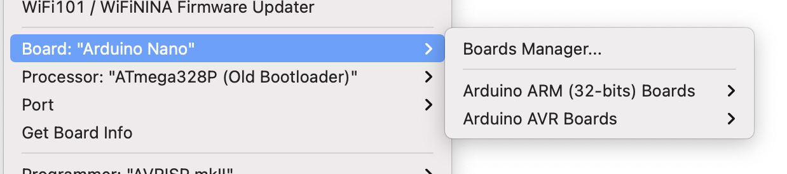
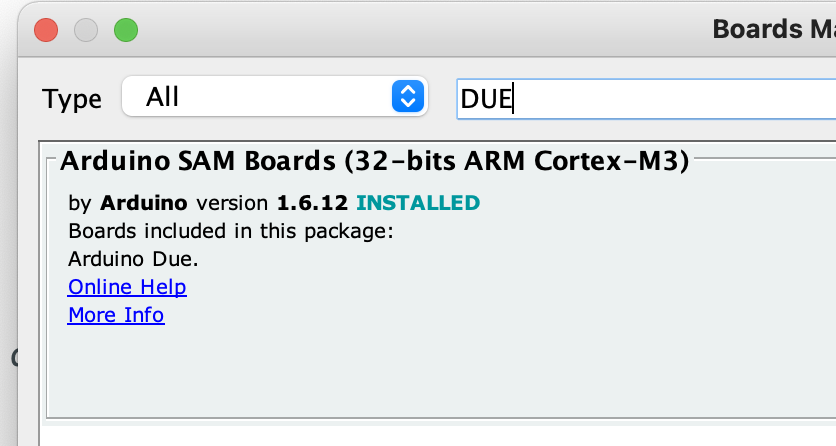
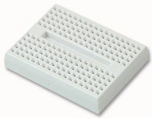
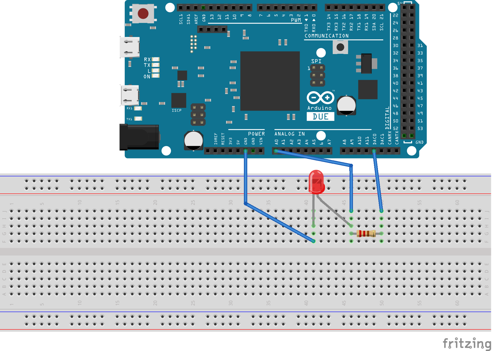

# Instructions to build the Python for the Lab DAQ

The PFTL DAQ is the ideal companion to follow the book [Python for the Lab](https://www.pythonforthelab.com/books/). Building the device itself is not part of the book because it focuses on Python best practices and not on lower-level electronics. In this article, we will quickly see how to build the device to follow the book to its fullest. 

## Materials
The device is built on an **Arduino DUE**, which can be purchased directly from [Arduino's webstore](https://store.arduino.cc/arduino-due) or any other supplier. The DUE choice was driven because it is the only board that provides analog outputs (also known as DAC). However, boards evolve over time, and there may be others available with the same options. 

Arduino also provides a program called [Arduino IDE](https://www.arduino.cc/en/software), which we need to load programs to the boards. However, the DUE is not available by default. To add the DUE to the list of compatible boards, we'll need to open the board manager. 

The board manager is under the menu Tools/Boards:

]

And the board manager will allow us to install the DUE:



To work with the board, we must load a special code to make it behave as we want. The code is [hosted here](https://github.com/PFTL/pythonforthelab/blob/458cd588e7d593dca15b58db1ab189e68d718c6b/extras/arduino_firmware/arduino_firmware.ino). Saving it to a file on the computer is enough. 

Open the code with the Arduino IDE, connect the board to the computer using the programming port (the USB port closest to the power jack). Select the board under Tools/Boards and the port on which it is connected. The last step is to click the *Upload* button, and you are ready to go. 

### Extra materials
Besides the DUE, there are some **small electronics required**. We need a small breadboard. Something like this is enough, but anything will work:



We also need one LED. The color does not matter, 3 jumper cables that make it easy to connect the Arduino and the breadboard, and one resistance of 220 Ohm. Overall, what we want to build looks like the following:



Sourcing the electronics components will depend on the country. There are some suppliers like Farnell and RS Electronics that may be available. Still, in general, any electronics do-it-yourself shop will be able to provide the elements. 

## Understanding the Arduino code
Although not part of the book, it can be useful to look at the code loaded to the Arduino. The approach is very similar to what was discussed in [this article](https://www.pythonforthelab.com/blog/how-control-arduino-computer-using-python/). Besides some boilerplate initialization of variables, we encounter the ``setup`` function. This function is called only once when the Arduino is boot up, which makes it the ideal place to initialize the communication with the computer or set the initial value of some outputs:

```c
void setup() {
  Serial.begin(9600);
  while (!Serial);
  analogWriteResolution(12);
  analogWrite(DAC0, 0);
  analogWrite(DAC1, 0);
  pinMode(ledPin, OUTPUT);
}
```

This already describes what the program will do: we will communicate through the serial port using a speed of 9600. We wait for the serial to become available before continuing. We set the resolution of the DAC to 12 bit and set both DAC ports to 0. The last bit is telling the board to use a specific digital pin as an output. 

What is more important is what happens in the ``loop`` function. This function runs forever in an infinite *loop* and therefore is where all the exchange of information and true workings of the Arduino will happen. We start by checking if there's data available on the serial port and we store it in a variable called ``Comm``:

```c
  while (Serial.available() > 0 ) {
    char value = Serial.read();
    Comm += value;
    if (value == '\n') {
      isData = true;
    }
  }
```

The variable ``Comm`` will tell the device what do we expect from it. If the message is ``IDN``, for example, we are expecting the device to identify itself, which it does:

```c
    if (Comm.startsWith("IDN")) {
      Serial.print("General DAQ Device built by Uetke. v.1.2019");
      Serial.print("\n");
    }
```

Another possible command is ``IN:CH1``to read the analog value on channel 1, which is also what the device does: 

```c
else if (Comm.startsWith("IN")) {
      channel = Comm[5];
      input = channel.toInt();
      val = analogRead(input);
      Serial.print(val);
      Serial.print("\n");
    }
```
