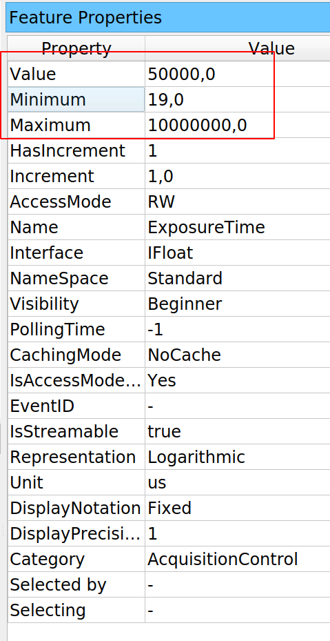

# Acquiring images from Basler Cameras

## Installing
Basler cameras require two components to work with Python. First, the [Pylon software suite](https://www.baslerweb.com/en/sales-support/downloads/software-downloads/#type=pylonsoftware;language=all;version=all), which includes Pylon Viewer, a program to quickly acquire images from the cameras, and also the libraries to build custom software. In the download page, be sure to select the package for your operating system and architecture. 

After installing Pylon, we can start the Pylon Viewer. This program allows us to test the camera, acquire images, and configure it. Testing whether we can acquire images is particularly important for Linux users, since accessing USB ports may require additional permissions depending on the system configuration. Also, the Pylon Viewer is a great starting point for finding out the name of the functions and parameters we may need to change in our programs. 

After Pylon is installed and working, we must install PyPylon, which is the Python wrapper for the Pylon SDK. We must get a release from the [Github repository](https://github.com/Basler/pypylon/releases). Bear in mind that PyPylon sometimes lags behind regarding Python releases. Be sure you are using a version of Python compatible with the PyPylon wheel available. To install the release, we can simply run the following (ideally inside a virtual environment):

```bash
pip install <pylon_wheel>.whl
```

### Problems with PyPylon installation
I have found that sometimes there is a mismatch between the latest Pylon version and the released PyPylon wheel available to download. Even if this does not raise problems during installation, it may be that we face an error like the following when running the examples of this tutorial:

```bash
ImportError: cannot import name '_pylon' 
```

The best solution is to [download the PyPylon code](https://github.com/basler/pypylon), and install it locally by running:

```bash
$ python setup.py install
```

Depending on your operating system, there may be another error associated with it. In Linux, Pylon is expected in the folder ``/opt/pylon5``, but newer versions of Pylon are installed on ``/opt/pylon``. The simplest solution is to create a system variable to point the installer to the right folder:

```bash
$ export PYLON_ROOT=/opt/pylon
$ python setup.py install
```

## Getting Started
When getting started, we must make sure that we can identify the camera we want to work with. This is not only useful for practical matters, but it is also useful to start understanding the patterns that the drivers require. We can run the following code:

```python
from pypylon import pylon


tl_factory = pylon.TlFactory.GetInstance()
devices = tl_factory.EnumerateDevices()
for device in devices:
    print(device.GetFriendlyName())
```

Which will generate a list of the cameras connected to our computer, similar to what we see with the PylonViewer program. In my case, the output is:

```bash
Basler a2A1920-160umBAS (40063823)
```

The code above starts by creating a *transport layer* instance, and enumerating the devices it has access to. According to the manual, the transport layer is an abstraction of the physical connection between the camera and the computer (i.e. USB, Camera Link, etc.). Its main purpose is to find and manage the life cycle of the cameras. The method ``EnumerateDevices`` returns a tuple containing information of each connected camera. 

Bear in mind that PyPylon is built using Swig, a library that allows to wrap C code into Python automatically. If we would print ``device`` instead of its friendly name, we would get an output like this:

```python
"<pypylon.pylon.DeviceInfo; proxy of <Swig Object of type 'Pylon::CDeviceInfo *' at 0x7fb7c3cd53f0> >"
```

Which is not particularly useful. Each object returned by the enumeration of the transport layer allows for the unique identification of the camera. This means that the information contained within it is all we need to start communicating with a camera. Other methods that may be useful to identify a camera are: ``GetFullName()`` which returns a unique code like ``2676:ba05:3:2:10``, or ``GetSerialNumber()`` which returns a number like ``40063823``. 

In many cases we have only one camera, and the rest of the article will proceed on that assumption. If it is not the case, we can address the camera we want by using its unique properties. 

## Acquiring an Image
If we are working with a camera, the first thing we may want to do is to acquire an image. We can create an ``InstantCamera`` object by running the following code:

```python
tl_factory = pylon.TlFactory.GetInstance()
camera = pylon.InstantCamera()
camera.Attach(tl_factory.CreateFirstDevice())
```

The code above consists of two steps. After getting the instance of the transport layer, we create an ``InstantCamera`` object. Basler provides these objects as a way of simplifying our work with their cameras, including handling the device life cycle, creating event callbacks, and physical device removal. If we are developing a highly specialized application, we may want to dive into Pylon's Device objects, which are not covered in this article. 

Once the ``InstantCamera`` is instantiated, we proceed to attach the first available camera to it. Note that the code above is transparent to the underlying data transport layer. We can use USB or GigE cameras with the same pattern. It is also important to point out that the transport layer is responsible for creating the actual device while ``camera`` is a convenient interface to it. 

To acquire an image, we must follow few steps that are quite self-explanatory:

```python
camera.Open()
camera.StartGrabbing(1)
grab = camera.RetrieveResult(2000, pylon.TimeoutHandling_Return)
if grab.GrabSucceeded():
    img = grab.GetArray()
    print(f'Size of image: {img.shape}')
camera.Close()
```

We start by opening the camera. At this stage we establish the communication with the device and Pylon takes care of applying some basic configuration. When we ``StartGrabbing`` with a single integer argument, we are telling Pylon the number of frames we want to acquire. When the camera reaches that number of frames it will stop acquiring new ones. This method is one of the convenience methods provided by the InstantCamera objects. 

In the code above, we grab only one frame. We retrieve the result, using a timeout of 2000 milliseconds, and we specify that if 2 seconds pass and there is no result, it would simply return to avoid raising an exception. The other option would have been using ``TimeoutHandling_ThrowException``. 

We check that the grab actually worked out, in which case we get the image using the ``GetArray`` method. The resulting ``img`` is a numpy array. We display the shape of the image and close the camera. Of course, we can also display the image, save it, etc. In any case, the most important first step is to be able to read from the camera. 

## Changing Parameters
Once we are able to read from a device, the second most important step is to change the acquisition parameters. In the case of a camera, the exposure time is one of the most important ones. The ``InstantCamera`` interface allows us to change it with the following syntax:

```python
camera.ExposureTime.SetValue(50000)
```

The syntax is pretty clear. If we want to change ``ExposureTime``, we can use a method called ``SetValue`` and provide the value in microseconds (see below for more discussion on units). If we check the Pylon manual, this is the pattern we will find for the parameters of the camera. However, since we are using **PyPylon**, we can also make use of an alternative syntax:

```python
camera.ExposureTime = 50000
```

Both examples generate the same effect, and show the difference between [functional or imperative programming](https://www.aquiles.me/functional_or_imperative_programming/). I, personally, believe the first one is clearer, since it will always raise an error if, for example, we use ``Exposure`` instead of ``ExposureTime``.

### Getting node information
One of the reasons for favoring the imperative setting of the exposure time (i.e. using ``SetValue``) is that ``ExposureTime`` is more complex than a simple number attribute of the camera. One common issue when setting values to a device is that we should know the limits and units of what we are passing. Pylon in that regard is very transparent and robust. 

```python
camera.Open()
print(camera.ExposureTime.GetUnit())
print(camera.ExposureTime.GetValue())
print(camera.ExposureTime.GetMin())
print(camera.ExposureTime.GetMax())
print(camera.ExposureTime.Unit)
print(camera.ExposureTime.Value)
print(camera.ExposureTime.Min)
print(camera.ExposureTime.Max)
camera.Close()
```

It is possible to get the units of the ``ExposureTime``, as well as the current value, the minimum, and the maximum. The code above shows the two ways of getting the information, using methods such as ``GetUnit`` or attributes like ``Unit``. Again, this is a matter of personal preference and consistency through larger projects. 

## PylonViewer  as documentation entry point
The examples above are a great starting point, but the main problem is that they are limited. As soon as we want to do something slightly different, we will need to use a different approach. For example, we know the minimum and maximum value of the exposure time, but how do we know the minimum difference between possible values? Fortunately, Basler bundles the PylonViewer with their software package. Let's see what information it provides when we select the exposure time:


For every parameter that we can change in the camera, PylonViewer tells us what method should be used to change and retrieve the value. But this is not the only information that it provides. If we open the Feature Properties panel (must be selected under the Window menu), we can also see a table with more information for that specific property:



The PylonViewer does not allow us to see how to retrieve that information, but if it is on the table it means it can be programmatically accessed. The PylonViewer gives us access to the Programmer's Guide if we click on the Help menu. Normally, the C++ guide is the easiest to translate into Python code. If we search for ``ExposureTime`` we will get several matches, but normally any ``Member List`` would be a good starting point. The information on ``ExposureTime`` may be a bit vague:


But it provides a very important hint (highlighted in red above). The Exposure time is not an ordinary number, but a ``Pylon::IFloatEx``. Without entering too much into details, if we click on it, we get the information we were looking for:

 

Every parameter that belongs to this class will have plenty of available information, the exposure time is only one of them. For basic applications it may be slightly far-fetched, but it is important to learn how to navigate the documentation in order to get the relevant information out and how it translates to Python. 

## Acquiring in free-run mode
With cameras, often we want to acquire images continuously, not just one frame. Free-run means that the camera will acquire frames one after the other until we tell it to stop. With Pylon cameras, this can be achieved by using the method ``StartGrabbing`` without specifying a maximum number of frames:

```python
camera.Open()
camera.StartGrabbing(pylon.GrabStrategy_OneByOne)
i = 0
print('Starting to acquire')
t0 = time.time()
while camera.IsGrabbing():
    grab = camera.RetrieveResult(100, pylon.TimeoutHandling_ThrowException)
    if grab.GrabSucceeded():
        i += 1
    if i == 100:
        break

print(f'Acquired {i} frames in {time.time()-t0:.0f} seconds')
camera.Close()
```

In this example, ``StartGrabbing`` receives a strategy of ``OneByOne``, which is equivalent to first-in, first-out. Frames are acquired in order and retrieved in order. We use the method ``IsGrabbing`` to check that the camera is actually acquiring data. Note that we are using only 100 milliseconds of timeout when retrieving the result. If the exposure time is longer than that, Pylon would raise an error. We could check it by combining this example with the previous one. 

If grabbing data was successful, we increase a counter. We stop the loop if we reach to 100 frames, but we could have used any other approach to stop the program at some point. It is important to note that we stop the loop, but not the grabbing itself. The grabbing stops when the camera is closed, courtesy of the ``InstantCamera`` object. It is possible to use ``StopGrabbing`` to stop the camera acquisition. 

## Timeout when retrieving the result
In the examples we've seen so far, we have set everything in order to avoid problems. However, we are one very simple step away from getting into trouble. We are using an exposure time of 50ms and a timeout of 100ms when retrieving the result. It is worth exploring what would happen if the timeout is shorter than the exposure time. 

```python
camera.Open()
camera.ExposureTime = 105000  # in us
camera.StartGrabbing(pylon.GrabStrategy_OneByOne)
grab = camera.RetrieveResult(100, pylon.TimeoutHandling_ThrowException)
if grab.GrabSucceeded():
    print('Grab succeded')

camera.Close()
```

If we run the code above we will see that many times it runs fine. Note that the difference between exposure time and timeout is only 5ms. If there's a slight delay between the start grabbing and the retrieving results, it is enough to pass through. If we try to acquire a couple of frames in a row, we'll see the problem:

```python
camera.Open()
camera.ExposureTime = 105000
camera.StartGrabbing(pylon.GrabStrategy_OneByOne)
for i in range(10):
    grab = camera.RetrieveResult(100, pylon.TimeoutHandling_ThrowException)
    if grab.GrabSucceeded():
        print('Grab succeded')

camera.Close()
```

The code above will generate an output like this:

```bash
Traceback (most recent call last):
  File "ac.py", line 17, in <module>
    grab = camera.RetrieveResult(100, pylon.TimeoutHandling_ThrowException)
  File "C:\Users\aquic\.conda\envs\disper\lib\site-packages\pypylon\pylon.py", line 3458, in RetrieveResult
    return _pylon.InstantCamera_RetrieveResult(self, *args)
_genicam.TimeoutException: Grab timed out. : TimeoutException thrown (file 'instantcameraimpl.h', line 1064)
```

Which is expected since we are using the option ``pylon.TimeoutHandling_ThrowException``. We can also try to use the other option, ``TimeoutHandling_Return``, in which case we would get this output:

```python
Traceback (most recent call last):
  File "ac.py", line 18, in <module>
    if grab.GrabSucceeded():
  File "C:\Users\aquic\.conda\envs\disper\lib\site-packages\pypylon\pylon.py", line 2229, in GrabSucceeded
    return _pylon.GrabResult_GrabSucceeded(self)
_genicam.RuntimeException: No grab result data is referenced. Cannot access NULL pointer. : RuntimeException thrown (file 'grabresultptr.cpp', line 84)
```

Both outputs exceptions, even if they have a timeout as the cause, are radically different. On the first one, it is the ``RetrieveResult`` method that raises the exception, while in the seccond is the ``GrabSucceeded``. For the first pattern, we can use a ``try... except`` block to catch the exception. For the second example, note that the error message states ``Cannot access NULL pointer``. This means that grab is actually NULL. We can therefore use another approach to deal with the second pattern:

```python
if grab and grab.GrabSucceeded():
    print('Grab succeded')
```

It must be clear that ``if grab`` is ``True`` only when the RetrieveResult didn't timeout. On the other hand, Python tests if-statements sequentially. It will first check ``if grab`` and *only* if it passes, it checks for ``GrabSucceeded()``. In this way we can quickly prevent the error without try-excepts. 

## Using callbacks
Python programmers do not use callbacks often, but they can be a useful pattern. The idea of a callback is that we can specify what functions gets executed when an action finishes. For a camera, we can think of what happens after a frame is acquired, or after the camera is initialized. Pylon implements these ideas through event handlers, which are a specific type of class that defines some methods. Let's define a very basic one so we can start digging on the options:

```python
class EventPrinter(pylon.ConfigurationEventHandler):
    def OnAttach(self, camera):
        print(f'Before attaching the camera {camera}')
```

The name, ``EventPrinter`` is arbitrary, but the method ``OnAttach`` is defined in the Pylon manual. As the name suggests, this method will be executed after a camera is attached, and it takes one argument: ``camera``. In order to use this event handler, we must register it:

```python
tl_factory = pylon.TlFactory.GetInstance()
camera = pylon.InstantCamera()
camera.RegisterConfiguration(EventPrinter(), pylon.RegistrationMode_Append, pylon.Cleanup_Delete)

camera.Attach(tl_factory.CreateFirstDevice())
```

Just the code above is enough to produce the following output:

```bash
# To complete!
```

Note that we used an instance of the ``EventPrinter``, we used the ``RegistrionMode_Append``, and we delete the configuration when we are done. Append means that the methods we defined are going to be executed after the ones already present. We could replace the previous methods by the new ones, for example. But the even handler is not limited to attaching the camera, there are many other possibilities:

```python
class EventPrinter(pylon.ConfigurationEventHandler):
    def OnAttach(self, camera):
        print(f'Before attaching the camera {camera}')

    def OnAttached(self, camera):
        print(f'Attached: {camera.GetDeviceInfo()}')

    def OnOpen(self, camera):
        print('Before opening')

    def OnOpened(self, camera):
        print('After Opening')

    def OnDestroy(self, camera):
        print('Before destroying')

    def OnDestroyed(self, camera):
        print('After destroying')

    def OnClosed(self, camera):
        print('Camera Closed')

    def OnDetach(self, camera):
        print('Detaching')

    def OnGrabStarted(self, camera):
        print('Grab started')
        time.sleep(2)
```

We can see that there's a great level of control at every stage of the camera lifecycle, and we have access to the camera itself. We could, for example, define some initial parameters for the camera, such as exposure time or gain, in such a way that we always start it in the same way. We can use this approach to let other parts of our program know when a camera is attached, starts grabbing or is destroyed. 

Another option is not the configuration handler, but the image handler. From a simple example is clear how it can be used:

```python
class ImageEventPrinter(pylon.ImageEventHandler):
    def OnImagesSkipped(self, camera, countOfSkippedImages):
        print("OnImagesSkipped event for device ", camera.GetDeviceInfo().GetModelName())
        print(countOfSkippedImages, " images have been skipped.")
        print()

    def OnImageGrabbed(self, camera, grabResult):
        print("OnImageGrabbed event for device ", camera.GetDeviceInfo().GetModelName())

        # Image grabbed successfully?
        if grabResult.GrabSucceeded():
            print("SizeX: ", grabResult.GetWidth())
            print("SizeY: ", grabResult.GetHeight())
            img = grabResult.GetArray()
            print("Gray values of first row: ", img[0])
            print()
        else:
            print("Error: ", grabResult.GetErrorCode(), grabResult.GetErrorDescription())
```

And in this case we register it with the following line:

```python
camera.RegisterImageEventHandler(ImageEventPrinter(), pylon.RegistrationMode_Append, pylon.Cleanup_Delete)
```

As we can see, with this approach the camera object itself knows what to do when an image is skipped or grabbed. We could, for example, save every image to the hard drive, or do some analysis and compression, etc. 

## Working with buffers
So far we have used the camera in its most simple setting, which is acquiring a finite number of images. However, if we want to acquire a movie we will need to keep up reading with the camera and doing something with the images we get. Pylon implements a ring buffer that we can use to do whatever we desire with each frame. 